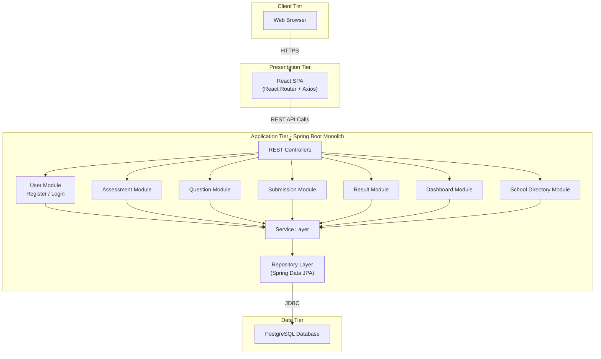

# 11. High-Level Architecture — Assessment Dashboard System

## 11.1 Overview

The Assessment Dashboard System follows a Monolithic Architecture where all business modules are deployed within a single Spring Boot application connected to a PostgreSQL database. The system provides role-based access for Administrators, Teachers, and Students through a React Single Page Application (SPA).

The React frontend communicates with the backend using REST APIs, while Spring Boot handles authentication, user management, assessment management, question management, submissions, results, dashboard analytics, and school directory information. All application data is stored in a centralized PostgreSQL database.

## 11.2 Architecture Diagram

